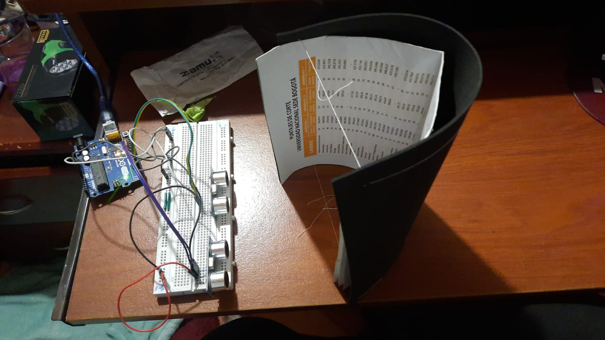
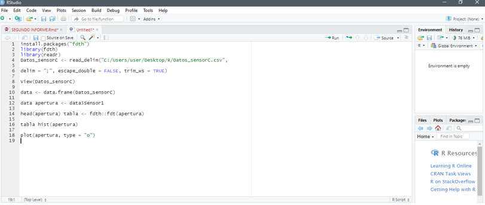
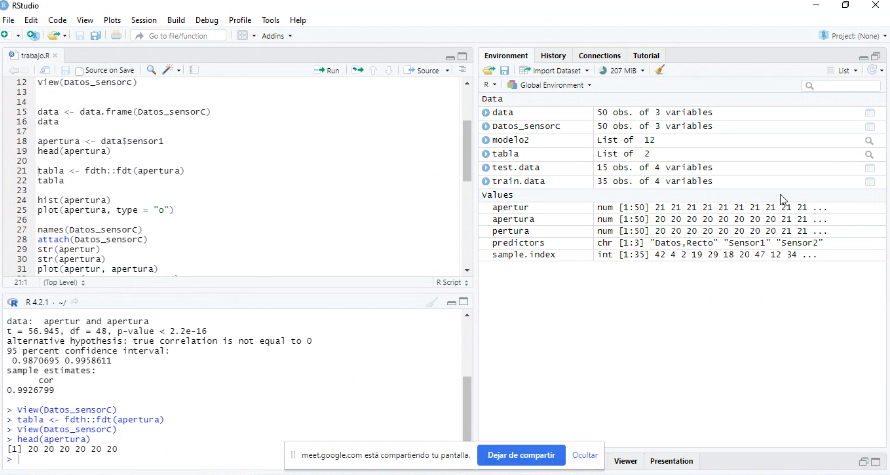
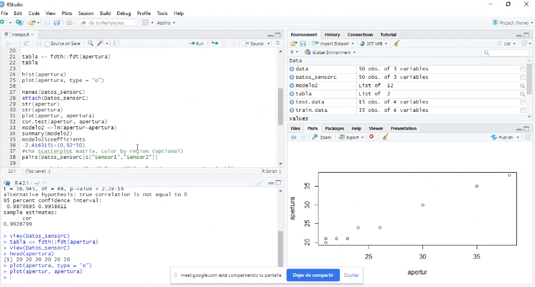
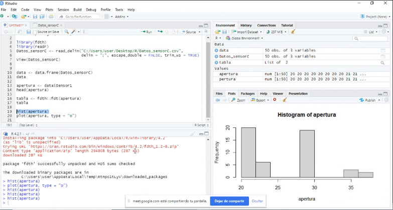
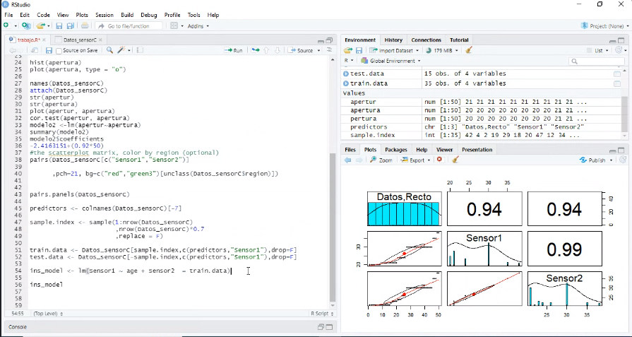
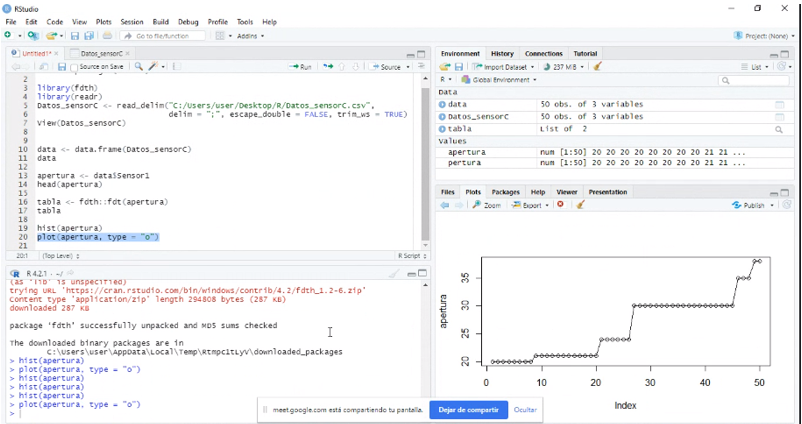
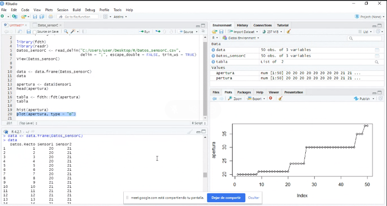

```{r setup, include=FALSE}
knitr::opts_chunk$set(echo = TRUE)
knitr::opts_chunk$set(eval = FALSE)
```
 \pagebreak
 
 \
 \
 

 
# OBJETIVO

 \
 \
 \
 \
 \
 \

-   Desarrollar un sistema de adquisición para capturar datos de distancia.

-   Diseñar un Hardware, que cuente con sensores para realizar mediciones al menos 50cm.

-   Entrenar un modelo lineal para que junto con los sensores generen una predicción de la distancia de los objetos.

-   Con el modelo n funcionamiento hacer toma de datos fuera de rango con un modelo construido para simular diversos ambientes.

\pagebreak

# PUNTO #1
\
\
\


  
    Para la construcción de un sistema que genere pruebas de validación, lo primero 
    
    
    que se generó es un montaje del circuito que tiene sensores de ultrasonido y
    
    
    componentes como *Arduino* para la toma, lectura y generación de tablas con los
    
    
    datos tomados, el cual     se realizó en un ambiente controlado con un modelo 
    
    
    que simula diferentes superficies para la toma de esta información como se
    
    
    muestra en la imagen 1.1, logrando realizar detección de distancias en un 
    
    
    rango solicitado de entre 10cm y 60cm, esto generando diferentes variables que 
    
    
    posterior a la toma de datos fueron insertados en un programa de reconocimiento
    
    
    y aprendizaje que luego de insertar los datos evaluaba diferentes variables y 
    
    
    generaba una regresión, el cual se estará enseñando su elaboración y montaje más adelante.

\
\
\
\
\
\
\

  {withd=50%} 


\pagebreak

\
\
\
\


    Posterior a esto se generó el modelo de predicción para poder evaluar los datos
    
    suministrados, el cual se realizó utilizando la interfaz de **Rstudios** para poder
    
    desarrollar un programa que, al obtener los datos de cada sensor, logre de una forma 
    
    precisa la distribución de estos datos en tablas operables para la interfas y 
    
    de igual poder ordenar las variables,  generar una regresión y con
    
    todos estos datos recogidos lograr demostrar el funcionamiento de los modelos
    
    como se muestra en las imagenes...
    
\pagebreak

- Se realiza la construccion del programa que tomara los datos y generara las graficas.

{withd=50%} 
{withd=50%} 
{withd=50%} 

\pagebreak

- Se pone en marcha el programa y se identifica que este generando las graficas correctamente.

{withd=50%}


\pagebreak

{withd=50%} 

- Se sigue revisando todo el proceso del programa para ver que las demas graficas esten de acuerdo a los datos suministrados.

{withd=50%}
\pagebreak


- por ultimo se revisa que todos los datos que salgan en la tabla al momento de correr el programa sean los mismos que se sustrajeron del programa en arduino al momento de tomar las mustras de la superficie.

{withd=50%}


\
\  
\
\
\
  
  

    
    
\pagebreak
  

# CONCLCUCIONES
\
\
\
\
\


El desarrollo de este laboratorio fue de gran utilidad ya que ayudo a reforzar algunos conceptos 

trabajados en clase, cómo las regresiones entre otros, el uso de componentes externos como hardware, fueron

de gran utilidad ya que nos permitieron utilizar de mejor forma los componentes y las ecuaciones de

**Rstudio** para así obtener un mejor detallado de cómo utilizar cada uno de estos elementos, de igual, el

uso de estos también permitió aumentas el estudio autónomo ya que supuso un gran reto la lectura de datos 

y la implementación del mismo al momento de importar la tabla de **Excel** a **Rstudio** y realizar cada una

de las operaciones para que el programa reconociera las herramientas y aprendiera a generar las variables

que necesitaba para poder gestionar el programa y tomas las muestras para luego poder generar las

aproximación de la superficie y la distancia a la que se encontraba del objeto teniendo en cuenta los

parámetros requeridos en el informe los cuales son entre (10cm - 60 cm),al final del proceso podemos evaluar

que los conocimientos en el uso de **Rstudio** y la implementación de software y hardware externos han

aumentado ampliamente y ya existen mayores herramientas y aprendizaje para un mejor uso del programa


y la implementación del mismo en diversas áreas.


\pagebreak


# BIBLIOGRAFIA

<https://www.youtube.com/watch?v=OyMcsbQlEN4>

<https://www.rstudio.com/wp-content/uploads/2015/03/rmarkdown-reference.pdf>

<https://drive.google.com/file/d/1tVct5yXDExdPa7MVl0NzHoH0NGbDQOpM/view>

<https://www.youtube.com/watch?v=Uxo2Ik-MlI8&ab_channel=EconometricsDataLab>

<https://leantec.es/wp-content/uploads/2019/06/Leantec.ES-HC-SR04.pdf>

<https://bookdown.org/gboccardo/manual-ED-UCH/introduccion-al-uso-de-rmarkdown-para-la-compilacion-de-resultados-de-rstudio-en-diferentes-formatos.html>

<https://rstudio-pubs-static.s3.amazonaws.com/330387_5a40ca72c3b14824acedceb7d34618d1.html>

<https://bookdown.org/gboccardo/manual-ED-UCH/uso-basico-de-rstudio.html>

<https://webs.um.es/gustavo.garrigos/quim2011/comandos_de_R.pdf>